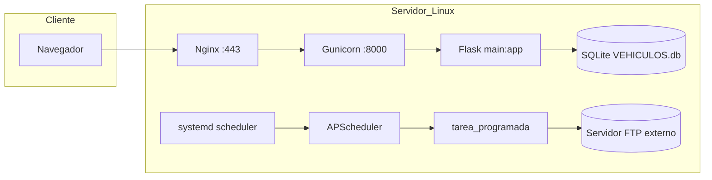
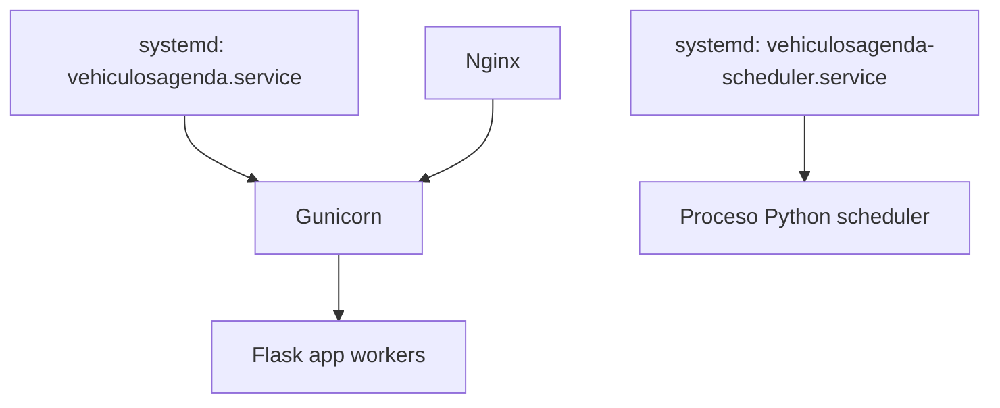

# Vehículos Agenda — Documentación técnica y de operaciones

**Versión del documento:** 1.0  
**Fecha de referencia:** 14 de mayo de 2026  
**Alcance:** aplicación Flask, transferencias FTP programadas, base de datos, despliegue Linux (Nginx, Gunicorn, systemd) y procedimientos de explotación.

---

## Índice

1. [Visión general del proyecto](#1-visión-general-del-proyecto)  
2. [Stack tecnológico](#2-stack-tecnológico)  
3. [Arquitectura actual](#3-arquitectura-actual)  
4. [Problema detectado y solución aplicada](#4-problema-detectado-y-solución-aplicada)  
5. [Configuración exacta del scheduler](#5-configuración-exacta-del-scheduler)  
6. [Servicios Linux y despliegue](#6-servicios-linux-y-despliegue)  
7. [Logs y troubleshooting](#7-logs-y-troubleshooting)  
8. [Seguridad](#8-seguridad)  
9. [Permisos Linux](#9-permisos-linux)  
10. [Recuperación ante fallo](#10-recuperación-ante-fallo)  
11. [Mejoras futuras recomendadas](#11-mejoras-futuras-recomendadas)  
12. [Diagramas](#12-diagramas)  
13. [Inventario técnico](#13-inventario-técnico)  
14. [Resultado final esperado / mapa documental](#14-resultado-final-esperado--mapa-documental)

---

## 1. Visión general del proyecto

### 1.1 Objetivo de la aplicación

**Vehículos Agenda** es una aplicación web interna orientada a la gestión operativa de una flota de vehículos y procesos asociados: vencimientos (ITV, seguros, tacógrafos, rodajes, extintores), talleres y visitas, tickets, ficheros y envíos a agencias (TSB, Pallex, XPO, carreras), **scanner** con subida a FTP/SFTP, **caja** (cobros, pagos, arqueos), **presupuestos** y facturas proforma, **RRHH** (formularios y envío por correo), **transferencia FTP automatizada** de documentos XPO entre carpetas de un mismo servidor FTP, y administración de usuarios/roles.

### 1.2 Funcionalidades principales

| Área | Descripción breve |
|------|-------------------|
| Autenticación | Login con `flask_login`; portada e `index` con avisos de vencimientos y redirecciones por usuario/rol (`static/roles_config.json`). |
| Flota | CRUD y consultas sobre vehículos, ITV, seguros, tacógrafos, rodajes, extintores, talleres, tareas. |
| Ficheros | Subida de ficheros genérica y por cliente (TS, Pallex, XPO, carreras). |
| Scanner / ALDIPOD | Captura, validación de códigos, subida FTP, incidencias, descargas agregadas (PDF) con SFTP en algunos flujos. |
| Caja y presupuestos | Módulos de caja y presupuestos con generación de PDF. |
| FTP transfer | Interfaz web manual y **tarea programada** que replica la lógica de `iniciar_transferencia()`. |
| Utilidades | Descarga de copia de la base SQLite (`/descargar_db`), email destinatarios, etc. |

### 1.3 Módulos existentes (paquetes / blueprints por convención)

Estructura lógica derivada de `main.py` (registro de rutas):

- `vehiculos/`, `itv/`, `seguros/`, `tacografos/`, `rodajes/`, `extintores/`
- `tickets/`, `talleres/`, `tareas/`, `transpaletas/`
- `ficheros/` (varios conectores de agencia)
- `scanner_ftp/`
- `ftp_transfer/`
- `caja/`, `presupuestos/`, `rrhh/`
- `manager/` (usuarios)
- `func_especiales/`
- Raíz: `main.py`, `main_sin_ssl.py`, `db.py`, `models.py`, `zmodels.py`, scripts de migración puntuales

### 1.4 Flujo general de funcionamiento

1. El **cliente** (navegador o móvil) accede por **HTTPS** (desarrollo con `ssl_context` en `main.py`) o por **HTTP/HTTPS** detrás de **Nginx** en producción.  
2. **Nginx** hace de proxy inverso hacia **Gunicorn** (proceso maestro + workers).  
3. Cada petición HTTP la atiende un **worker** de Gunicorn que ejecuta la aplicación **Flask** (`app`).  
4. Flask usa **SQLAlchemy** con sesión por petición (`db.close_session` en `teardown_appcontext`).  
5. La **tarea FTP periódica** no debe ejecutarse en los workers: corre en un **proceso aparte** bajo **systemd** con **APScheduler** (ver sección 4 y 5).

### 1.5 Dependencias externas

- **Servidor FTP** `ftpclientes.nereid.es` (orígenes/destinos XPO según configuración en código).  
- **SFTP** en flujos del scanner (p. ej. host 1&1 / IONOS en `scanner_ftp/scanner_ftp.py` — credenciales en código, ver seguridad).  
- **SMTP** para RRHH (`rrhh_mailer.py`): preferentemente variables de entorno; existe valor por defecto en código si no se define `SMTP_PASSWORD`.  
- **Sistema de archivos** para `static/subidas` y base `database/VEHICULOS.db`.

### 1.6 Integraciones FTP

- **Manual:** formulario en ruta `/ftp_transfer` → `iniciar_transferencia` con datos de formulario.  
- **Automática:** `tarea_programada()` → `cargar_config_ftp()` → `iniciar_transferencia(datos)` con diccionario fijo (misma topología que la UI por defecto).  
- **Scanner:** subidas y operaciones FTP/SFTP en `scanner_ftp/funciones_scanner.py` y rutas en `scanner_ftp/scanner_ftp.py`.

### 1.7 Estructura de carpetas (resumen)

```
vehiculosagenda/
├── main.py                 # Entrada Flask producción / desarrollo
├── main_sin_ssl.py       # Variante sin SSL; ¡ojo! aún llama iniciar_scheduler() — ver §4
├── db.py                   # Motor SQLite, sesión por request
├── models.py               # Modelos SQLAlchemy
├── database/               # VEHICULOS.db (ruta absoluta desde db.py)
├── static/                 # CSS, roles_config.json, subidas/
├── templates/              # Jinja2
├── ftp_transfer/
│   └── ftp_transfer.py     # Rutas FTP, scheduler, tarea_programada
├── scanner_ftp/
├── caja/, presupuestos/, rrhh/, tickets/, ...
├── requirements.txt
└── DOCUMENTACION.MD        # Este documento
```

---

## 2. Stack tecnológico

### 2.1 Versiones (referencia)

Las versiones **pin** del proyecto están en `requirements.txt`:

| Componente | Declaración en `requirements.txt` | Notas |
|------------|-------------------------------------|--------|
| Python | *(no fijada en archivo)* | En desarrollo se ha usado entorno con bytecode `cpython-314`; en servidor Linux conviene **fijar** versión (p. ej. 3.11 o 3.12 LTS). |
| Flask | `~=3.0.2` | App factory implícita: `app = Flask(__name__)` en `main.py`. |
| SQLAlchemy | `~=2.0.27` | ORM + `create_engine` SQLite. |
| APScheduler | `apscheduler` (sin pin menor) | Instalar versión compatible y congelar en `pip freeze` en producción. |
| Gunicorn | `gunicorn` (sin pin) | Servidor WSGI multi-worker. |
| Otros | `flask_login`, `flask-cors`, `paramiko`, `pandas`, `openpyxl`, `pymupdf` | Scanner SFTP, exportaciones, PDF. |

**Recomendación de explotación:** generar en el servidor `requirements.freeze.txt` con `pip freeze` tras un despliegue validado y versionar ese archivo.

### 2.2 Componentes de infraestructura

| Pieza | Rol |
|-------|-----|
| **Python venv** | Aislamiento de dependencias; el `ExecStart` de systemd debe usar el `python` del venv. |
| **Gunicorn** | Ejecuta `main:app` (objeto `app` en `main.py`). |
| **Nginx** | TLS terminación, `proxy_pass` a Gunicorn, límites de tamaño de cuerpo para subidas, cabeceras `X-Forwarded-*`. |
| **systemd** | Unidades `vehiculosagenda` (Gunicorn) y `vehiculosagenda-scheduler` (solo scheduler). |
| **SQLite** | Base única `database/VEHICULOS.db`; `check_same_thread=False` para uso multi-hilo en workers. |

### 2.3 Base de datos

- **Motor:** SQLite (`sqlite:///…/database/VEHICULOS.db`).  
- **No** MySQL/PostgreSQL en el código actual de `db.py`. Una migración futura a cliente/servidor implicaría cambiar `create_engine` y pruebas de concurrencia.

### 2.4 Frontend

- **Jinja2** templates + HTML/CSS estático (`static/`).  
- No hay bundler SPA (React/Vue) en el repositorio raíz: es **server-rendered**.

---

## 3. Arquitectura actual

### 3.1 Cadena HTTP

```
Cliente (HTTPS)
    → Nginx (:443 o :80)
        → proxy_pass http://127.0.0.1:<PUERTO_GUNICORN>/
            → Gunicorn (master)
                → Worker 1 … Worker N → Flask (main:app)
```

### 3.2 Scheduler independiente

```
systemd (vehiculosagenda-scheduler.service)
    → python run_scheduler.py   (o equivalente documentado en §5)
        → APScheduler (BackgroundScheduler)
            → tarea_programada()
                → iniciar_transferencia()
```

### 3.3 Puertos (típicos en producción)

| Servicio | Puerto típico | Comentario |
|----------|---------------|------------|
| Nginx | 80 / 443 | Público hacia usuarios. |
| Gunicorn | 8000 / 127.0.0.1:5000 | Solo loopback; el valor exacto depende del unit file. |
| Flask dev (`main.py`) | 5000 | Solo desarrollo; SSL adhoc. |

**Workers Gunicorn:** en el incidente documentado había **6 workers** (`-w 6`). Cada uno cargaba `main.py` y, con `iniciar_scheduler()` activo, lanzaba **6 schedulers**.

### 3.4 Threading y SQLite

- Gunicorn suele usar **workers de proceso** (`sync` o `gthread`): cada worker es un **proceso** distinto.  
- SQLite con `check_same_thread=False` permite conexiones desde distintos hilos **dentro del mismo proceso**; con **varios procesos** escribiendo a la vez puede haber bloqueos o riesgo de corrupción si las escrituras son intensivas. La app usa sesión por request y commit al final; conviene **backups** y monitorizar `database is locked`.

### 3.5 Rutas importantes (referencia)

| Ruta | Uso |
|------|-----|
| `/login`, `/logout`, `/portada`, `/index` | Autenticación y tablero principal. |
| `/ftp_transfer` | UI transferencia FTP manual. |
| `/ftp_transfer/estado_scheduler` | JSON estado del scheduler **en ese proceso** (si no se inició scheduler, indicará no iniciado). |
| `/ftp_transfer/ejecutar_ahora` | Dispara `tarea_programada()` en el worker que atiende la petición (uso prudente en prod). |
| `/descargar_db` | Descarga SQLite (solo usuarios autorizados por login). |
| `/scanner_clientes`, `/registro_incidencias_aldipod` | Scanner e incidencias. |

---

## 4. Problema detectado y solución aplicada

### 4.1 Problema original

- **APScheduler** se iniciaba desde `main.py` mediante `iniciar_scheduler()` tras registrar rutas.  
- **Gunicorn** arrancaba **N workers** (p. ej. 6).  
- Cada worker importa `main.py` y ejecutaba `iniciar_scheduler()` al cargar la aplicación.  
- Resultado: **N instancias** del scheduler, cada una con el mismo job cada 30 minutos.  
- La tarea FTP (`tarea_programada` → `iniciar_transferencia`) se ejecutaba **en paralelo** desde varios PIDs sobre el **mismo servidor FTP y los mismos ficheros**.

Síntomas observados (coherentes con condición de carrera en FTP):

| Síntoma | Causa probable |
|---------|------------------|
| **Broken pipe** | Conexión FTP cerrada por otro proceso o timeout por contención. |
| **550 File not found** | Otro worker ya movió o borró el fichero en origen. |
| **500 Failed to delete file** / errores al borrar | `delete` concurrente tras `RETR`/`STOR`. |
| **Transferencias duplicadas** | Múltiples `STOR` del mismo nombre a destinos. |
| **Borrados simultáneos** | Varios procesos ejecutan `ftp_origen.delete(archivo)`. |

### 4.2 Evidencias encontradas

- **Logs de Gunicorn** / aplicación mostrando múltiples bloques `INICIO DE TAREA PROGRAMADA` encadenados o con marcas de tiempo casi idénticas desde distintos PIDs.  
- **Múltiples PIDs** ejecutando `tarea_programada` (ejemplo de incidente):

  - Workers / procesos: **105496, 105497, 105498, 105499, 105500, 105501** (seis procesos, alineado con seis workers).

- `tarea_programada()` escribe en **stderr** el PID (`os.getpid()`), lo que facilita correlacionar con `ps` / `journalctl`.

### 4.3 Solución implementada

1. **Comentar** la llamada a `iniciar_scheduler()` en `main.py` para que **ningún worker** de Gunicorn inicie el scheduler.  
2. Mover la ejecución de APScheduler a un **servicio systemd independiente** (`vehiculosagenda-scheduler.service`) con **un solo proceso**.  
3. Mantener Gunicorn **únicamente** para servir Flask.  
4. Endurecer el job en `iniciar_scheduler()`:

   - `max_instances=1` — no solapar ejecuciones del mismo job.  
   - `coalesce=True` — si hubo retrasos, una sola ejecución “recupera” el atraso.  
   - `next_run_time=datetime.datetime.now() + timedelta(minutes=30)` — primera ejecución diferida; evita tormenta al arrancar todos los servicios a la vez (ajustable).

### 4.4 Aviso sobre `main_sin_ssl.py`

El archivo `main_sin_ssl.py` **sigue llamando a** `iniciar_scheduler()` (aprox. línea 77). **No** debe desplegarse como `main:app` con múltiples workers sin eliminar esa llamada, o se reproduce el incidente.

---

## 5. Configuración exacta del scheduler

### 5.1 Archivo `ftp_transfer/ftp_transfer.py`

Funciones y elementos relevantes:

| Elemento | Responsabilidad |
|----------|-----------------|
| `register_ftp_transfer_routes(app)` | Rutas Flask `/ftp_transfer`, transferencia manual, endpoints de prueba/diagnóstico. |
| `iniciar_transferencia(datos)` | Lógica FTP: conexión origen, listado de archivos, bucle destinos, `RETR`/`STOR`, `delete` en origen, límite `MAX_ARCHIVOS = 20`. |
| `cargar_config_ftp()` | Devuelve dict fijo (misma estructura que la UI por defecto); **no** lee JSON externo en la implementación actual. |
| `tarea_programada()` | Carga config, llama `iniciar_transferencia`, imprime logs a **stderr**. |
| `iniciar_scheduler()` | Crea `BackgroundScheduler`, añade job por intervalo, `start()`. |

### 5.2 Frecuencia de ejecución

- **Trigger:** `interval`  
- **Parámetro:** `minutes=30` → ejecución cada **30 minutos** una vez arrancado el scheduler.  
- **Primera ejecución:** programada explícitamente a **+30 minutos** desde el arranque (`next_run_time`).

### 5.3 Configuración APScheduler actual (extracto lógico)

```text
BackgroundScheduler(daemon=False)
add_job(
  tarea_programada,
  'interval',
  minutes=30,
  id='tarea_ftp_transfer',
  replace_existing=True,
  max_instances=1,
  coalesce=True,
  next_run_time=now + 30 minutes
)
start()
```

### 5.4 Protección contra solapes

| Mecanismo | Efecto |
|-----------|--------|
| `max_instances=1` | Si una ejecución dura más de 30 minutos, la siguiente no arranca en paralelo. |
| `coalesce=True` | Múltiples disparos “atrasados” se fusionan en uno. |
| **Proceso único systemd** | Garantía operativa de **una** instancia global del scheduler (la principal). |
| `replace_existing=True` | Reemplaza job con mismo `id` si se re-registra. |

### 5.5 Comportamiento ante reinicios

- Al **reiniciar el servidor** o el unit `vehiculosagenda-scheduler`: el scheduler se reinicia; la **primera** ejecución de la tarea ocurre a los **30 minutos** salvo que se cambie `next_run_time`.  
- Si se necesita ejecución inmediata al arranque, ajustar `next_run_time` a `datetime.datetime.now()` o lanzar manualmente una pasada (ver runbook §10).

### 5.6 Script recomendado para el servicio scheduler

`BackgroundScheduler` no bloquea el hilo principal indefinidamente por sí solo de forma portable en todos los despliegues. Se recomienda un script **`run_scheduler.py`** en la raíz del proyecto (crear si no existe):

```python
#!/usr/bin/env python3
"""Proceso dedicado: una sola instancia de APScheduler para FTP."""
import time
from ftp_transfer.ftp_transfer import iniciar_scheduler

if __name__ == "__main__":
    iniciar_scheduler()
    while True:
        time.sleep(3600)
```

Permisos: `chmod +x run_scheduler.py` (opcional si se invoca con `python` explícito).

### 5.7 Unidad systemd: `/etc/systemd/system/vehiculosagenda-scheduler.service`

> **Nota:** Sustituir `WorkingDirectory` y rutas del venv por las reales del servidor (ej. `/var/www/vehiculosagenda`).

```ini
[Unit]
Description=Vehiculos Agenda - APScheduler (transferencia FTP XPO)
Documentation=file:///var/www/vehiculosagenda/DOCUMENTACION.MD
After=network-online.target
Wants=network-online.target

[Service]
Type=simple
User=www-data
Group=www-data
WorkingDirectory=/var/www/vehiculosagenda
Environment=PYTHONUNBUFFERED=1
ExecStart=/var/www/vehiculosagenda/venv/bin/python /var/www/vehiculosagenda/run_scheduler.py
Restart=on-failure
RestartSec=10

[Install]
WantedBy=multi-user.target
```

#### Explicación línea por línea

| Línea | Significado |
|-------|-------------|
| `[Unit]` | Inicio de sección de metadatos y dependencias. |
| `Description=…` | Texto mostrado en `systemctl status`. |
| `Documentation=…` | URI de ayuda (opcional; apunta a esta documentación desplegada). |
| `After=network-online.target` | No arrancar antes de que la red esté razonablemente lista. |
| `Wants=network-online.target` | Arranque blando de la dependencia de red. |
| `[Service]` | Configuración del proceso. |
| `Type=simple` | El proceso principal (`ExecStart`) es el servicio; systemd considera activo al fork inicial. |
| `User=` / `Group=` | Ejecutar como usuario de servidor web (típico `www-data`) para alinear permisos con Gunicorn y ficheros. |
| `WorkingDirectory=` | `import ftp_transfer` y `database/` deben resolverse igual que en Gunicorn. |
| `Environment=PYTHONUNBUFFERED=1` | Logs Python en journal sin buffer excesivo. |
| `ExecStart=` | Intérprete del **venv** + script que mantiene vivo el proceso y llama `iniciar_scheduler()`. |
| `Restart=on-failure` | Reinicio automático si el proceso falla. |
| `RestartSec=10` | Espera entre reinicios. |
| `[Install]` | Instalación en target. |
| `WantedBy=multi-user.target` | Habilitar con `systemctl enable` arranca en runlevel multiusuario. |

---

## 6. Servicios Linux y despliegue

### 6.1 Servicio Gunicorn (`vehiculosagenda.service` — ejemplo)

No hay unit file en el repositorio; patrón habitual:

```ini
[Unit]
Description=Vehiculos Agenda (Gunicorn + Flask)
After=network.target

[Service]
User=www-data
Group=www-data
WorkingDirectory=/var/www/vehiculosagenda
Environment=PATH=/var/www/vehiculosagenda/venv/bin
ExecStart=/var/www/vehiculosagenda/venv/bin/gunicorn \
  --workers 6 \
  --bind 127.0.0.1:8000 \
  main:app
Restart=always

[Install]
WantedBy=multi-user.target
```

Ajustar `--workers` según CPU y carga (y recordar: **no** iniciar scheduler aquí).

### 6.2 Servicio scheduler

Ver §5.7. Habilitar con:

```bash
sudo systemctl daemon-reload
sudo systemctl enable vehiculosagenda-scheduler
sudo systemctl start vehiculosagenda-scheduler
```

### 6.3 Nginx (ubicaciones típicas)

- `/etc/nginx/sites-available/vehiculosagenda`  
- Enlace: `/etc/nginx/sites-enabled/vehiculosagenda`  

Directivas habituales: `server_name`, `ssl_certificate`, `location / { proxy_pass http://127.0.0.1:8000; }`, `client_max_body_size` para subidas.

### 6.4 Comandos útiles (systemd / journald)

```bash
# Estado
sudo systemctl status vehiculosagenda
sudo systemctl status vehiculosagenda-scheduler

# Reinicio
sudo systemctl restart vehiculosagenda
sudo systemctl restart vehiculosagenda-scheduler

# Recargar unidad tras editar .service
sudo systemctl daemon-reload

# Habilitar / deshabilitar al arranque
sudo systemctl enable vehiculosagenda vehiculosagenda-scheduler
sudo systemctl disable vehiculosagenda-scheduler

# Logs en vivo
sudo journalctl -u vehiculosagenda -f
sudo journalctl -u vehiculosagenda-scheduler -f

# Nginx: probar config y recargar
sudo nginx -t
sudo systemctl reload nginx
```

---

## 7. Logs y troubleshooting

### 7.1 Dónde están los logs

| Origen | Ubicación |
|--------|-----------|
| Gunicorn / Flask | `journalctl -u vehiculosagenda` (si stdout/stderr van a journal). |
| Scheduler FTP | `journalctl -u vehiculosagenda-scheduler`. |
| Nginx | `/var/log/nginx/access.log`, `/var/log/nginx/error.log`. |
| SQLAlchemy / db | `db.py` configura logging INFO; puede mezclarse con salida del worker. |

### 7.2 Ver logs en vivo

```bash
sudo journalctl -u vehiculosagenda-scheduler -f
```

### 7.3 Detectar errores FTP

Buscar en journal:

- `Error al transferir`  
- `550`  
- `Broken pipe`  
- `Error durante la transferencia`  
- Traza `ERROR CRÍTICO en tarea_programada`

Los mensajes de `iniciar_transferencia` en la tarea programada se imprimen línea a línea en **stderr** desde `tarea_programada()`.

### 7.4 Detectar múltiples schedulers (regresión)

```bash
ps aux | grep -E "run_scheduler|tarea_programada|apscheduler" 
# O contar líneas con INICIO DE TAREA PROGRAMADA en ventana corta
sudo journalctl -u vehiculosagenda --since "10 min ago" | grep "INICIO DE TAREA PROGRAMADA"
```

Si aparecen **varios PIDs distintos** en el **mismo** minuto para el mismo patrón de inicio, revisar si `iniciar_scheduler()` volvió a activarse en `main.py` o si hay varios units duplicados.

### 7.5 Detectar workers duplicados (esperado vs incidente)

- **Esperado:** un master Gunicorn + N workers; cada uno con PID distinto pero **sin** scheduler FTP.  
- **Incidente:** N workers **y** cada uno logueando `Iniciando scheduler... PID:` y `INICIO DE TAREA PROGRAMADA`.

### 7.6 Verificar próximas ejecuciones APScheduler

- Desde código: endpoint `/ftp_transfer/estado_scheduler` refleja el estado **del proceso que atiende la petición** (worker), no el proceso systemd del scheduler, salvo que se arquitecte de otra forma.  
- **Operativo:** inspeccionar logs del unit scheduler al arranque: lista de jobs y `next_run_time` impresa por `iniciar_scheduler()`.

### 7.7 Ejemplos de mensajes útiles (patrones)

```text
Iniciando scheduler... PID: 12345
Scheduler iniciado correctamente. Tarea programada cada 30 minutos. PID: 12345
============== INICIO DE TAREA PROGRAMADA ==============
PID del proceso: 12345
=============== FIN DE TAREA PROGRAMADA ================
```

Si el PID cambia entre líneas de la **misma** ejecución lógica en el mismo timestamp para la misma tarea, sospechar de múltiples procesos.

---

## 8. Seguridad

### 8.1 Secretos en código (auditoría)

| Ubicación | Tipo de riesgo |
|-----------|----------------|
| `ftp_transfer/ftp_transfer.py` | Usuario/contraseña FTP y listas de conexión **embebidas** en rutas y en `cargar_config_ftp()`. |
| `main.py` | `SECRET_KEY` de Flask en texto plano. |
| `scanner_ftp/scanner_ftp.py` | Credenciales **SFTP** literales en funciones de descarga/consulta. |
| `rrhh_mailer.py` | Fallback de contraseña SMTP si falta variable de entorno. |

**No** duplicar estas credenciales en tickets o chats; rotarlas si se filtraron.

### 8.2 Riesgo de imprimir contraseñas en logs

- `iniciar_transferencia` registra usuario y rutas; en configuración manual la plantilla puede recibir contraseñas en contexto de render (evitar mostrar en UI logs compartidos).  
- Cualquier `print` de dicts con credenciales debe evitarse.

### 8.3 Recomendaciones

1. Variables de entorno o fichero `.env` **fuera de git** para FTP, SFTP, `SECRET_KEY`, SMTP.  
2. Permisos `0600` en ficheros de secretos; usuario de servicio mínimo privilegio.  
3. **SSH** en servidor: solo clave, sin root login, `AllowUsers` acotado.  
4. **fail2ban** en Nginx/SSH contra fuerza bruta.  
5. Preferir **SFTP/FTPS** donde el proveedor lo permita; FTP plano expone credenciales en red.  
6. Rotación periódica de contraseñas tras migración a vault/.env.

---

## 9. Permisos Linux

### 9.1 Problema típico (sysadmin / despliegue)

- Desarrollo en Windows + subida con **WinSCP** como otro usuario (`root`, `deploy`, etc.) deja ficheros con **owner** distinto de `www-data`.  
- Gunicorn no puede escribir en `database/` o `static/subidas` → errores 500 o fallos al guardar.

### 9.2 Ownership y grupos recomendados

```bash
sudo chown -R www-data:www-data /var/www/vehiculosagenda/database
sudo chown -R www-data:www-data /var/www/vehiculosagenda/static/subidas
```

Opcional: grupo compartido `vehiculosagenda` con `www-data` y permisos `2775` en directorios de datos si hace falta que un usuario de despliegue suba ficheros.

### 9.3 Permisos de ficheros

- Directorios: `755` o `750` según política.  
- `VEHICULOS.db`: escritura solo para el usuario del servicio (`www-data`).  
- Claves TLS: lectura solo root + grupo cert (`640`).

### 9.4 WinSCP

- Tras subir código, ejecutar `chown`/`chmod` en el servidor o configurar WinSCP para respetar usuario destino vía **SFTP** y comando post-subida documentado en runbook interno.

---

## 10. Recuperación ante fallo (runbook)

### 10.1 Reiniciar toda la aplicación

```bash
sudo systemctl restart vehiculosagenda
sudo systemctl restart vehiculosagenda-scheduler
sudo systemctl reload nginx
```

### 10.2 Verificar servicios

```bash
sudo systemctl is-active vehiculosagenda vehiculosagenda-scheduler nginx
curl -I http://127.0.0.1:8000/login
```

### 10.3 Comprobar scheduler

```bash
sudo systemctl status vehiculosagenda-scheduler
sudo journalctl -u vehiculosagenda-scheduler -n 200 --no-pager
```

### 10.4 Comprobar Nginx

```bash
sudo nginx -t && sudo systemctl status nginx
```

### 10.5 Validar FTP

- Probar UI `/ftp_transfer` con usuario técnico (ventana de mantenimiento).  
- O ejecutar una pasada controlada desde entorno aislado con credenciales de `.env`.

### 10.6 Tras reboot del servidor

```bash
sudo systemctl enable vehiculosagenda vehiculosagenda-scheduler nginx
# Tras reboot:
sudo systemctl status vehiculosagenda vehiculosagenda-scheduler nginx
```

### 10.7 Cuellos de botella

- **CPU:** demasiados workers Gunicorn vs cores.  
- **Disco I/O:** SQLite con muchas escrituras concurrentes.  
- **Red:** latencia FTP; límite `MAX_ARCHIVOS=20` por ejecución.  
- **Tiempo de request:** rutas que descargan muchos PDF/SFTP (presupuesto de tiempo en `scanner_ftp`).

---

## 11. Mejoras futuras recomendadas

1. **Secretos:** migrar FTP/SFTP/`SECRET_KEY`/SMTP a variables de entorno y eliminar literales del repositorio.  
2. **Cola de trabajos:** **Celery** o **RQ** con broker (Redis) para tareas largas (FTP, PDF masivos) con un solo consumer o control de concurrencia explícito.  
3. **Métricas:** Prometheus + Grafana o al menos healthchecks HTTP (`/healthz`).  
4. **Logs estructurados:** JSON en stdout para agregación (Loki, ELK).  
5. **FTP:** reintentos con backoff, idempotencia por nombre de fichero + checksum, mover a carpeta “processing” antes de borrar origen.  
6. **Base de datos:** valorar PostgreSQL si crece concurrencia de escritura.  
7. **Alertas:** notificación si el scheduler no escribe logs en X horas o si Nginx devuelve 5xx sostenido.

---

## 12. Diagramas

### 12.1 Arquitectura (Mermaid)



### 12.2 Flujo FTP (ASCII)

```
[cargar_config_ftp]
        |
        v
[FTP origen: login, cwd XPOsalidas]
        |
        v
[Listar archivos nlst / retrlines / LIST]
        |
        v
+--> Para cada destino (prefix + directory)
|       login, cwd
|       para cada archivo con prefijo
|            RETR -> buffer -> STOR
|            DELETE en origen
+---- (max 20 archivos por ejecución)
```

### 12.3 Scheduler (ASCII)

```
[systemd start]
      |
      v
[run_scheduler.py]
      |
      v
[iniciar_scheduler] --> BackgroundScheduler.start()
      |
      +-- cada 30 min --> [tarea_programada]
                              |
                              v
                        [iniciar_transferencia]
```

### 12.4 Interacción Gunicorn / Nginx / systemd (Mermaid)



---

## 13. Inventario técnico

### 13.1 Servicios (producción típica)

| Unidad | Propósito |
|--------|-----------|
| `nginx.service` | Proxy y TLS |
| `vehiculosagenda.service` | Gunicorn + Flask |
| `vehiculosagenda-scheduler.service` | APScheduler + FTP |

### 13.2 Puertos

| Puerto | Servicio |
|--------|----------|
| 443 / 80 | Nginx |
| 8000 (ejemplo) | Gunicorn bind loopback |

### 13.3 Rutas importantes

| Ruta | Descripción |
|------|-------------|
| `/login` | Autenticación |
| `/index` | Tablero con avisos |
| `/ftp_transfer` | Transferencia manual |
| `/ftp_transfer/estado_scheduler` | Diagnóstico scheduler en worker |
| `/descargar_db` | Backup SQLite |

### 13.4 Comandos frecuentes

| Comando | Uso |
|---------|-----|
| `sudo systemctl restart vehiculosagenda` | Reiniciar web |
| `sudo systemctl restart vehiculosagenda-scheduler` | Reiniciar tareas FTP |
| `sudo journalctl -u vehiculosagenda-scheduler -f` | Seguimiento FTP |
| `sudo nginx -t` | Validar Nginx |

### 13.5 Dependencias Python (alto nivel)

Ver `requirements.txt`: Flask, SQLAlchemy, flask_login, gunicorn, apscheduler, paramiko, pandas, openpyxl, pymupdf, flask-cors, DateTime.

### 13.6 Cronología de cambios (referencia técnica)

| Evento | Detalle |
|--------|---------|
| Despliegue multi-worker | Gunicorn con varios workers sirviendo Flask. |
| Regresión | `iniciar_scheduler()` en `main.py` provocó N schedulers. |
| Corrección | Comentar `iniciar_scheduler()` en `main.py`; proceso dedicado systemd. |
| Endurecimiento | `max_instances=1`, `coalesce=True`, `next_run_time` controlado en `iniciar_scheduler()`. |
| Deuda | `main_sin_ssl.py` aún invoca `iniciar_scheduler()` — alinear con `main.py`. |

---

## 14. Resultado final esperado / mapa documental

Este fichero **`DOCUMENTACION.MD`** actúa como:

| Entregable solicitado | Sección(es) |
|----------------------|-------------|
| README técnico completo | §1, §2, §3, §13 |
| Documentación de operaciones | §6, §7, §10 |
| Documentación de despliegue | §5, §6, §9 |
| Troubleshooting handbook | §4, §7, §10 |
| Arquitectura | §3, §12 |
| Runbook de incidencias | §4, §10, §7 |

**Mantenimiento del documento:** actualizar al cambiar unidades systemd, puertos, número de workers, periodicidad del job o motor de base de datos.

---

*Fin del documento.*
